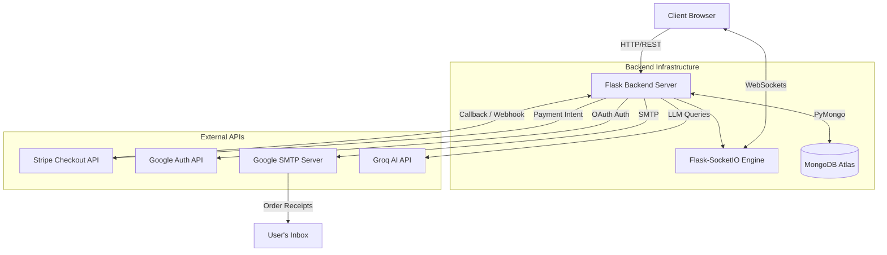

<div align="center">
  
  <h1>Waggy Pet Shop 🐾</h1>
  <p><strong>An Enterprise-Grade, Real-Time E-Commerce Platform Built for Pet Lovers</strong></p>
  
  <p>
    <a href="https://github.com/Neerav02/Waggy-Pet-Shop/issues"></a>
    <a href="https://github.com/Neerav02/Waggy-Pet-Shop/stargazers"></a>
    <a href="https://github.com/Neerav02/Waggy-Pet-Shop/blob/main/LICENSE"></a>
  </p>
</div>

---

## 📖 Overview
Waggy Pet Shop is a fully-featured, production-ready web application designed as a sophisticated e-commerce solution. It combines modern architectural patterns, such as **Real-Time WebSockets**, **Secure Cloud Payments**, and **AI Integration**, all wrapped in a beautifully frosted-glass, dynamic 3D-background user interface. 

This project is ideal for showcasing full-stack capabilities, secure routing, database management, and third-party API orchestration.

## ✨ Key Features
- 🛒 **Complete E-Commerce Flow:** Browsing, Cart Management, Checkout, and Order History.
- 💳 **Stripe Integration:** Secure online payment processing with Stripe Checkout Sessions.
- ⚡ **Real-Time WebSockets:** Live order status updates broadcasted directly to the user's dashboard via `Flask-SocketIO`.
- 📧 **Automated Email Receipts:** Beautifully formatted HTML order confirmations sent automatically using `Flask-Mail` and Google SMTP.
- 🔐 **Google OAuth 2.0:** One-click secure authentication natively integrated with MongoDB.
- 🤖 **AI Assistant:** An intelligent chatbot powered by the `Groq` API, capable of answering pet-related queries instantly.
- 🛠️ **Admin Dashboard:** Centralized control panel for administrators to process orders, modify statuses, and manage inventory.
- 🎨 **Premium UI/UX:** Responsive design powered by Bootstrap, featuring 3D animated backgrounds (`Three.js`), frosted glassmorphism, and smooth transitions.

---

## 🏗️ System Architecture



---

## 🗂️ Folder Structure

```text
Waggy-Pet-Shop/
├── app.py                 # Main Application & Route Controller
├── requirements.txt       # Python Dependencies
├── .env                   # Environment Variables (Not Tracked)
├── Procfile / vercel.json # Deployment Configuration Files
├── static/
│   ├── css/
│   │   └── style.css      # Core Stylesheet & Animations
│   ├── js/
│   │   ├── main.js        # Core Interactivity
│   │   ├── ai-chat.js     # AI Chatbot Logic
│   │   └── three-bg.js    # 3D Background Engine
│   └── images/            # Assets & Uploads
└── templates/
    ├── base.html          # Master Layout Template
    ├── components/        # Reusable UI Snippets (Navbar, Chatbot)
    ├── email/             # HTML Email Templates
    └── ...                # Application Pages (Shop, Checkout, Profile, Admin)
```

---

## 🚀 Getting Started

### Prerequisites
- Python 3.10+
- A MongoDB Atlas Account / Connection URI
- A Stripe Developer Account (Test Mode)
- Google Cloud Console Project (For OAuth)

### 1. Clone the Repository
```bash
git clone https://github.com/Neerav02/Waggy-Pet-Shop.git
cd Waggy-Pet-Shop
```

### 2. Set Up Virtual Environment
```bash
python -m venv venv
# Windows:
venv\Scripts\activate
# Mac/Linux:
source venv/bin/activate
```

### 3. Install Dependencies
```bash
pip install -r requirements.txt
```

### 4. Configure Environment Variables
Create a `.env` file in the root directory and populate it with your API credentials:
```env
# Core & Database
SECRET_KEY=your_secure_flask_key
MONGO_URI=mongodb+srv://<username>:<password>@cluster...

# Google OAuth
GOOGLE_CLIENT_ID=your_google_client_id.apps.googleusercontent.com
GOOGLE_CLIENT_SECRET=your_google_client_secret
GOOGLE_DISCOVERY_URL=https://accounts.google.com/.well-known/openid-configuration

# Groq AI Assistant
GROQ_API_KEY=your_groq_api_key

# Admin Panel Setup
ADMIN_USERNAME=admin
ADMIN_PASSWORD=your_secure_password

# Email Automation (Gmail)
MAIL_SERVER=smtp.gmail.com
MAIL_PORT=587
MAIL_USE_TLS=True
MAIL_USERNAME=your_email@gmail.com
MAIL_PASSWORD=your_google_app_password

# Stripe Payment Gateway
STRIPE_PUBLIC_KEY=pk_test_your_key
STRIPE_SECRET_KEY=sk_test_your_key
```

### 5. Run the Application
```bash
python app.py
```
> **Note:** The application uses `Flask-SocketIO`. Ensure you completely restart the server whenever making core configuration changes.

Navigate to `http://127.0.0.1:5000` in your browser!

---

## 🛠️ Technology Stack
- **Backend:** Python, Flask, Flask-SocketIO, Flask-Mail
- **Database:** MongoDB Atlas (PyMongo)
- **Frontend:** HTML5, CSS3, Vanilla JavaScript, Bootstrap 5, Three.js
- **Third-Party Services:** Stripe, Groq (AI), Google Cloud (OAuth & SMTP)

## 🤝 Contributing
Contributions, issues, and feature requests are welcome! Feel free to check the [issues page](https://github.com/Neerav02/Waggy-Pet-Shop/issues).

## 📄 License
This project is open-source and available under the [MIT License](LICENSE).
